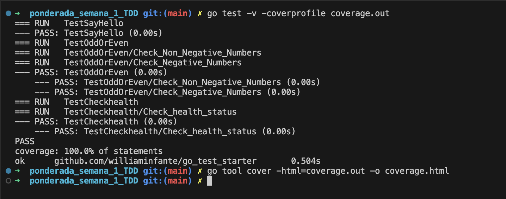

# Golang Testing with TDD

Este repositório contém a resolução da atividade ponderada proposta no card "Implementando TDD na Prática - 1", utilizando os exemplos do artigo "Golang Testing with TDD". O artigo explica como aplicar o Desenvolvimento Orientado a Testes (TDD) em Go.

## Estrutura do Repositório

- **starter.go**: Implementação das funções descritas no artigo.
- **starter_test.go**: Testes unitários e de integração utilizando o TDD.
- **coverage.html**: Relatório de cobertura gerado pelos testes.

## 1. Execução dos Exemplos

### 1.1. Função `SayHello`

A função `SayHello` aceita um argumento de string e retorna uma saudação personalizada.


### 1.2. Função `OddOrEven`

A função `OddOrEven` verifica se um número é ímpar ou par.


### 1.3. Função `CheckHealth`

A função `CheckHealth` simula uma verificação de saúde de uma página HTTP.


## 2. Expansão dos Comentários

Cada função e teste no código foi comentado para explicar os conceitos de TDD aplicados, como o ciclo Red-Green-Refactor, a importância da cobertura de testes e a utilização de subtestes.


## 3. Exemplos de Aplicação do TDD

Nesta seção, apresento trechos de código comentados para demonstrar como as técnicas de TDD foram aplicadas no desenvolvimento das funções e testes.

### 3.1. Função `SayHello` e Teste Correspondente


### 3.2. Função `OddOrEven` e Teste Correspondente


### 3.3. Função `CheckHealth` e Teste Correspondente


### 3.4 Cobertura de Código
```bash
# Geração do relatório de cobertura
# A cobertura de testes foi verificada para garantir que todas as partes críticas do código estão sendo testadas.
go test -v -coverprofile coverage.out

# Geração do relatório de cobertura em formato HTML
go tool cover -html=coverage.out -o coverage.html
```




## 4. Conclusão
Este projeto demonstra a aplicação prática do TDD em Golang, abordando desde testes básicos até testes avançados de integração, garantindo um design modular e testável. O desenvolvimento orientado a testes não é apenas uma técnica de teste, mas uma abordagem que impulsiona a qualidade do software desde o início do desenvolvimento. Ao seguir o ciclo Red-Green-Refactor, os desenvolvedores são forçados a pensar nos requisitos e no design do código antes mesmo de escrever a implementação, o que resulta em um código mais limpo, mais modular e menos propenso a erros. Além disso, o TDD promove uma maior cobertura de testes, garantindo que todas as funcionalidades do código sejam testadas e validadas constantemente. Essa prática não apenas previne defeitos, mas também facilita a manutenção e a evolução do software ao longo do tempo.